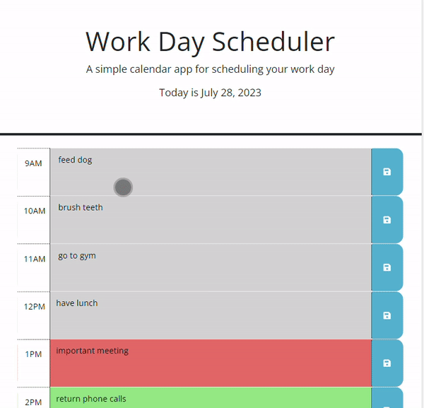

# 05 Third-Party APIs: Work Day Scheduler

## Description

I created a simple calendar application that allows a user to save events for each hour of the work day. The app allows the user to input tasks for each hour and then gives them the option to save them in local storage. When the user returns to the page their saved tasks will be reloaded.

## Tasks 

- Added today's date to the header of the application.
- Created timeblocks for each hour 9am-5pm.
- Time blocks are color-coded based on past present and future.
- Clicking timeblock allows user to input task and save the task to local storage.

## Usage

## Links
Deployed Webpage: 
GitHub Repo Page: https://github.com/rambriz91/planz

## Credits

- https://day.js.org/
- https://api.jquery.com/each/
- https://day.js.org/docs/en/display/format

## License

MIT License

Copyright (c) [2023] [Robert Ambriz]

Permission is hereby granted, free of charge, to any person obtaining a copy
of this software and associated documentation files (the "Software"), to deal
in the Software without restriction, including without limitation the rights
to use, copy, modify, merge, publish, distribute, sublicense, and/or sell
copies of the Software, and to permit persons to whom the Software is
furnished to do so, subject to the following conditions:

The above copyright notice and this permission notice shall be included in all
copies or substantial portions of the Software.

THE SOFTWARE IS PROVIDED "AS IS", WITHOUT WARRANTY OF ANY KIND, EXPRESS OR
IMPLIED, INCLUDING BUT NOT LIMITED TO THE WARRANTIES OF MERCHANTABILITY,
FITNESS FOR A PARTICULAR PURPOSE AND NONINFRINGEMENT. IN NO EVENT SHALL THE
AUTHORS OR COPYRIGHT HOLDERS BE LIABLE FOR ANY CLAIM, DAMAGES OR OTHER
LIABILITY, WHETHER IN AN ACTION OF CONTRACT, TORT OR OTHERWISE, ARISING FROM,
OUT OF OR IN CONNECTION WITH THE SOFTWARE OR THE USE OR OTHER DEALINGS IN THE
SOFTWARE.